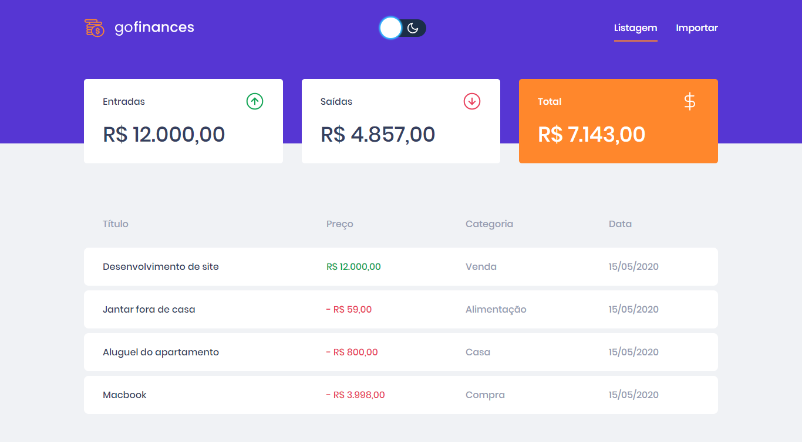
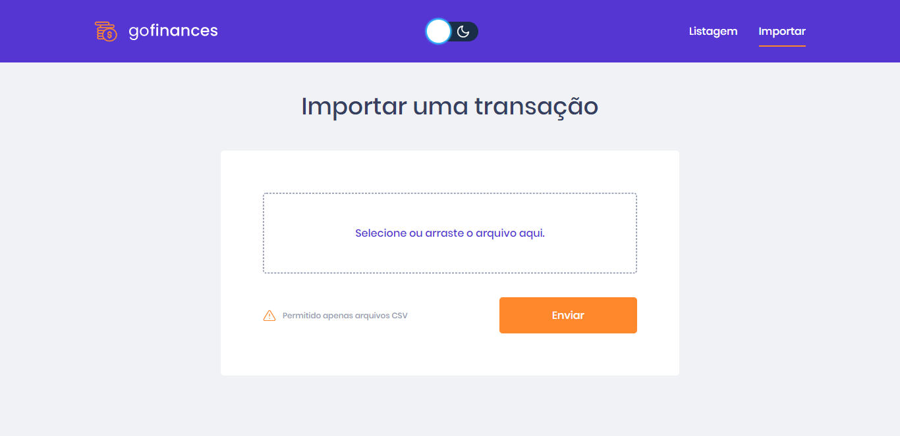
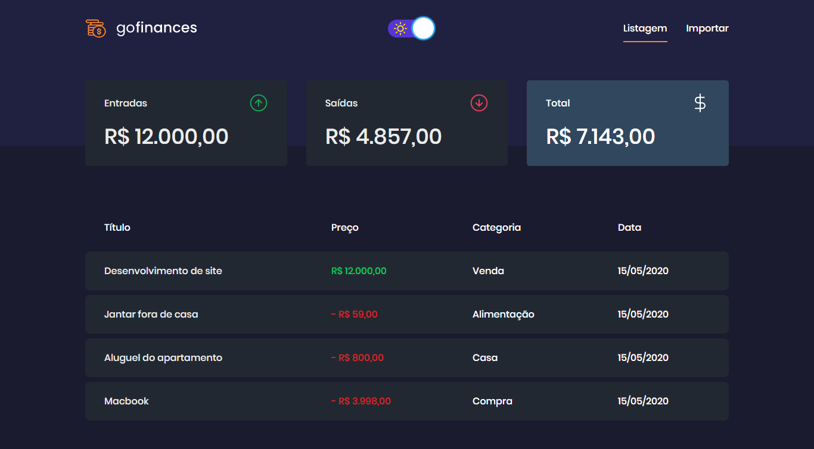
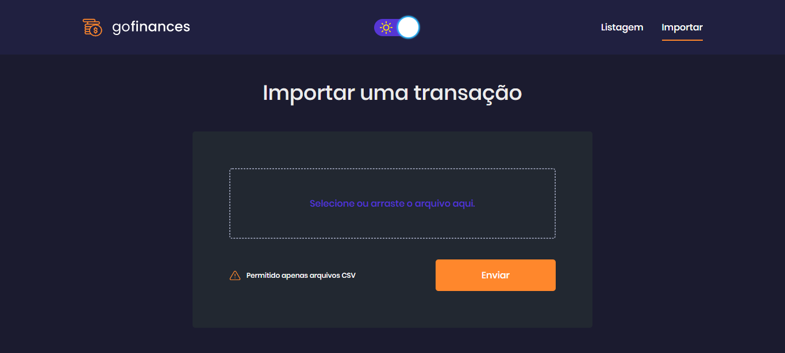

<h1 align="center">
  
</h1>

<h2 align="center"> Tema Light </h2>

---

<h2 align="center">
  Listagem
  <br/>
  <br/>
  
</h2>

<h2 align="center">
  Importar
  <br/>
  <br/>
  
</h2>

<h2 align="center"> Tema Dark </h2>

---

<h2 align="center">
  Listagem
  <br/>
  <br/>
  
</h2>

<h2 align="center">
  Importar
  <br/>
  <br/>
  
</h2>

# Indice

- 📝️ [Sobre](#%EF%B8%8F-sobre)
- 👨‍💻️ [Tecnogias utilizadas](#%EF%B8%8F-tecnogias-utilizadas)
- 📋️ [IDE e Facilidades](#%EF%B8%8F-ide-e-facilidades)
- 📦️ [Como baixar o projeto](#%EF%B8%8F-como-baixar-o-projeto)
- 🤔️ [Como contribuir](#%EF%B8%8F-como-contribuir)

---

## 📝️ Sobre

O projeto **goFinances** foi um desafio proposto no **Bootcamp GoStack** da [Rocketseat](https://rocketseat.com.br/) com objetivo do aluno mostrar que consegue desenvolver sozinho uma Aplicação Web consumindo a [API do gofinances](https://github.com/rafaelsouz/gofinances-api) que realiza transações bancárias conectada ao um banco de dados Postgress.

Com essa aplicação é possível visualizar as transações realizadas com todos os detalhes, como categoria, tipo da transação(entrada ou saída), o valor e a data. além disso é exibido também o total que existe na conta.
Caso o usuário queria cadastrar mais transações, pode importar um arquivo CSV(seguindo esse [modelo](./github/transacoes.csv)) que a aplicação ler todo o arquivo e cadastra as transações.

E o usuário ainda pode alterar o tema da aplicação para versão Dark ou Light.

Caso você queria ver todo o enuciado do desafio só clicar [aqui](https://github.com/Rocketseat/bootcamp-gostack-desafios/tree/master/desafio-fundamentos-reactjs).

---

## 👨‍💻️ Tecnogias utilizadas

O projeto foi desenvolvido utilizando as seguintes tecnologias:

- [TypeScript](https://www.npmjs.com/package/typescript)
- [Axios](https://www.npmjs.com/package/axios)
- [Filesize](https://www.npmjs.com/package/filesize)
- [History](https://www.npmjs.com/package/history)
- [Polished](https://www.npmjs.com/package/polished)
- [React](https://www.npmjs.com/package/react)
- [Styled-components](https://www.npmjs.com/package/styled-components)
- [React-dropzone](https://www.npmjs.com/package/react-dropzone)
- [React-icons](https://www.npmjs.com/package/react-icons)
- [React-router-dom](https://www.npmjs.com/package/react-router-dom)

---

## 📋️ IDE e Facilidades

- [Visual Studio Code](https://code.visualstudio.com/)
- [Editor Config](https://editorconfig.org/)
- [ESLint](https://eslint.org/)
- [Prettier](https://prettier.io/)

---

## 📦️ Como baixar o projeto

```bash
  # Clonar o repositório
  ❯ git clone https://github.com/rafaelsouz/gofinances-web.git

  # Entrar no diretório
  ❯ cd gofinances-web

  # Instalando as dependências
  ❯ yarn
  # ou pode usar o `npm`
  ❯ npm install
```

## 🤔️ Como contribuir

1. Faça o `fork` deste repositório
2. Crie uma branch com sua feature:
   - `$ git checkout -b minha_feature`
3. Confirme sua branch:
   - `$ git commit -m "feature: Meu novo recurso"`
4. Envie sua branch:
   - `$ git push origin minha_feature`

---

<h4 align="center">
  Feito com ❤ por Rafael 👋️<a href="https://www.linkedin.com/in/rafaelsouz/" target="_blank"> Entre em contato!</a>
</h4>

---
